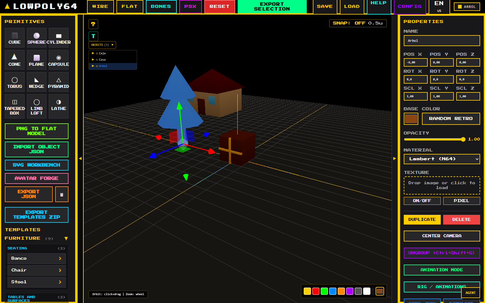
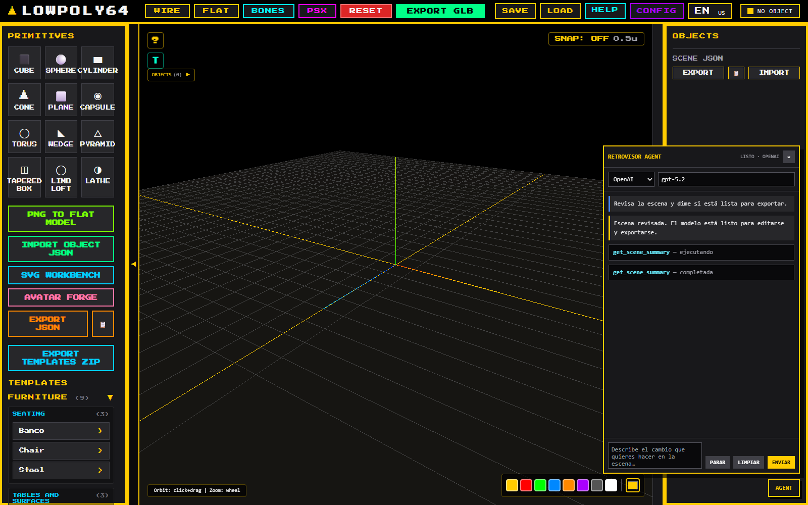
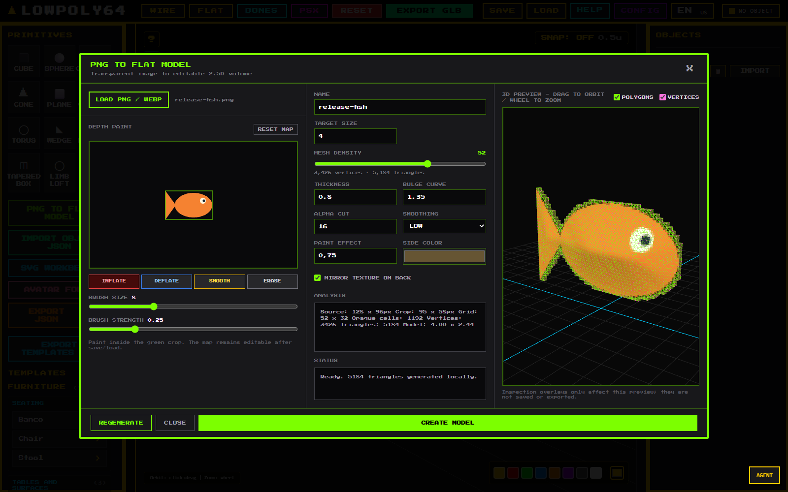
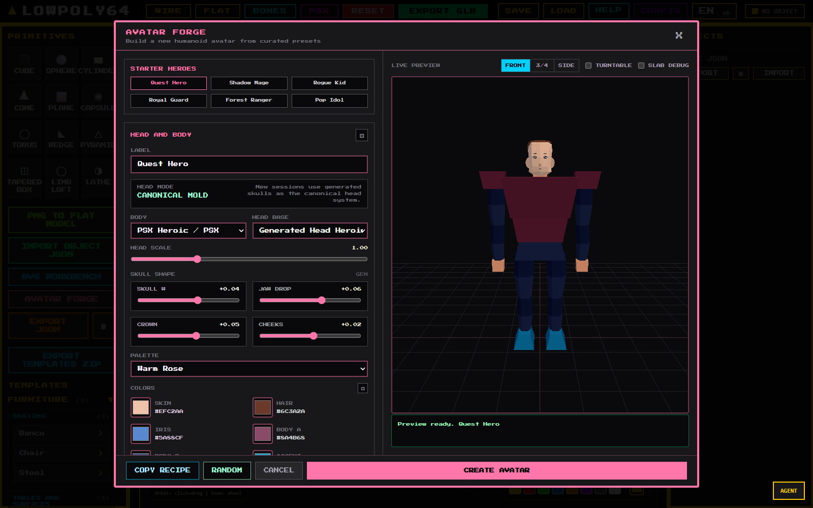
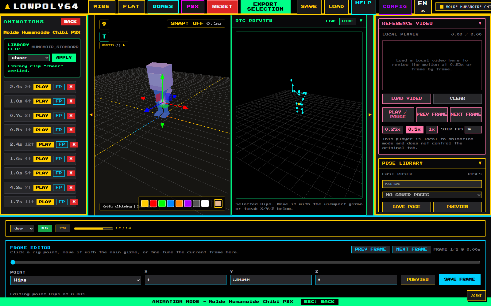
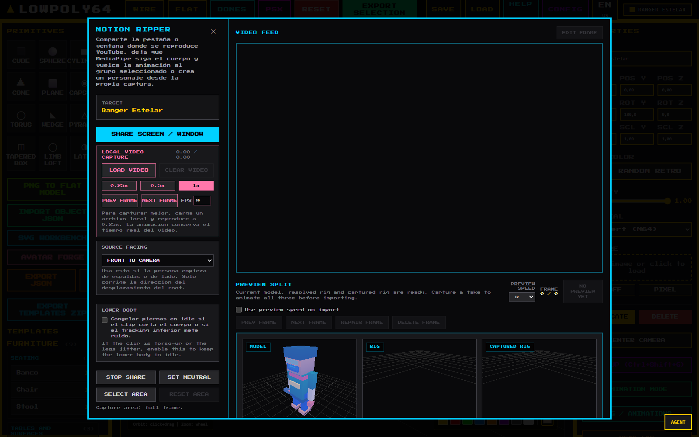
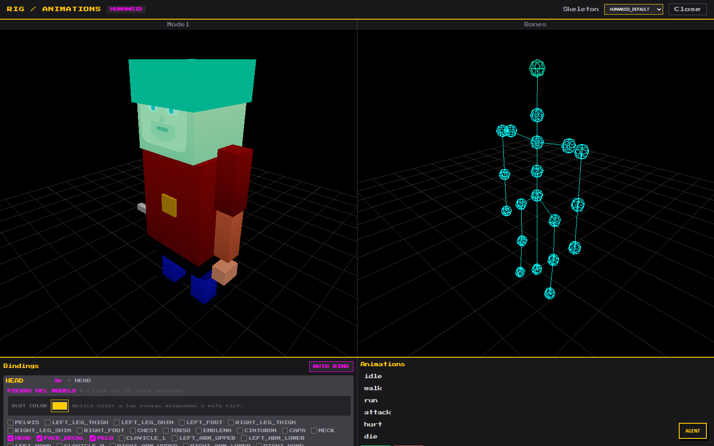
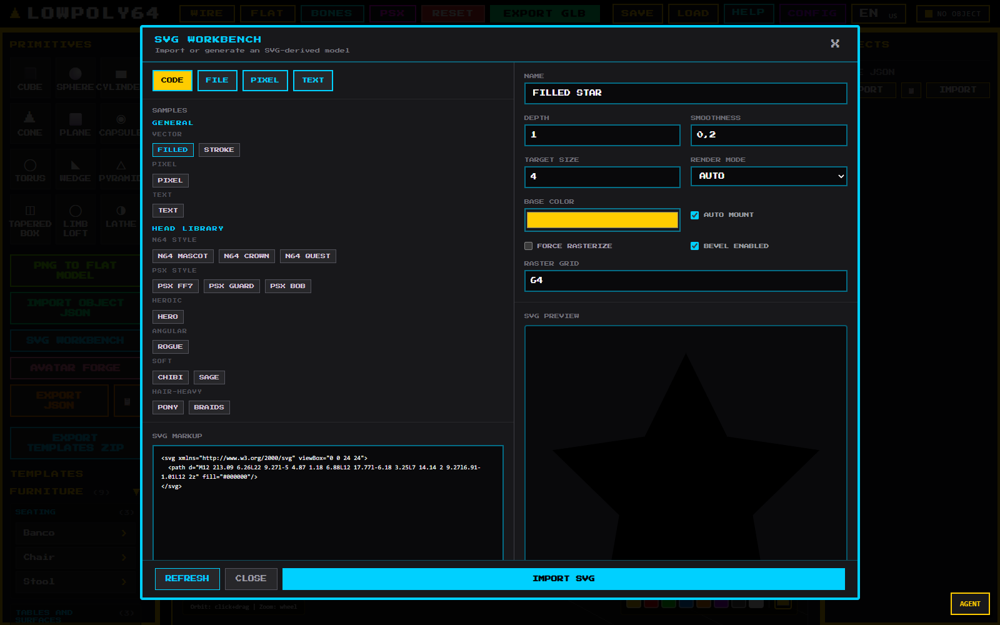
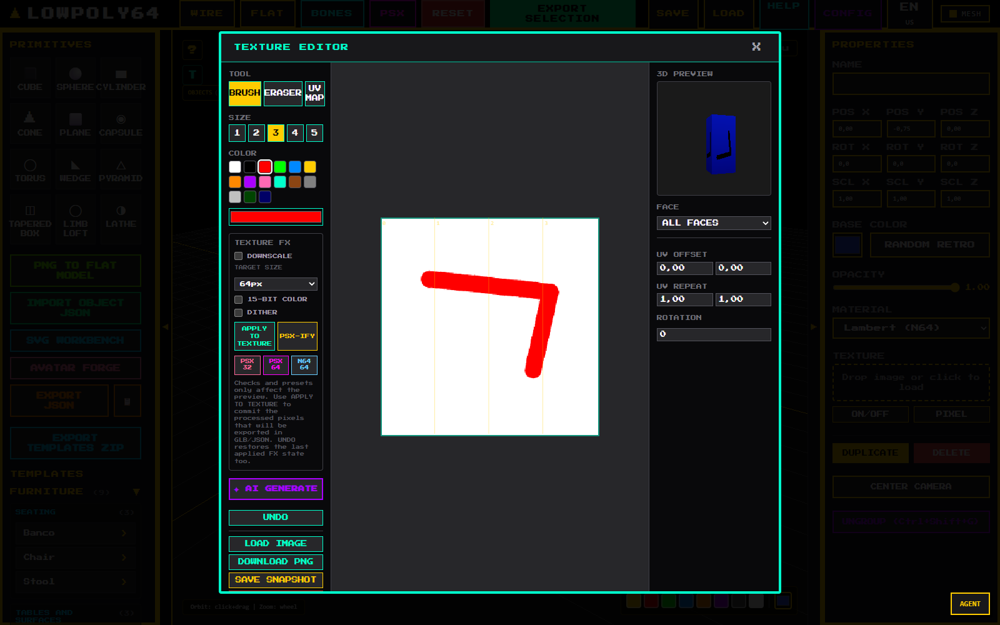

# Retrovisor 3D v0.8.0 — Forge, motion and local agent

Release date: 2026-07-29

Retrovisor 3D v0.8.0 expands the editor from object authoring into a more
complete character workflow: build avatars, rig and animate them, recover
motion from local video, create 2.5D models from transparent images, and use a
local agent without sending scene data through an intermediary.



## Highlights

### Local-first agent

The new `AGENT` panel and MCP bridge expose the same validated scene commands
and undo/redo path. Provider credentials remain in the local Node companion
instead of being bundled into the browser.



See [README-MCP.md](README-MCP.md) and
[docs/retrovisor-agent.md](docs/retrovisor-agent.md).

### PNG to Flat Model

Transparent PNG/WebP silhouettes can now become closed, textured 2.5D meshes.
The workbench includes density, thickness, bulge, alpha and smoothing controls,
plus paintable inflate/deflate corrections and a live orbitable preview.



See [docs/png-to-flat-model.md](docs/png-to-flat-model.md).

### Avatar Forge

Avatar Forge now provides generated head molds, facial placement controls, six
Starter Hero recipes, per-section randomization, a turntable preview and recipe
copying. Legacy saved head IDs migrate to the closest generated mold.



### Animation and Motion Ripper

`HUMANOID_STANDARD` now contains 13 clips, including `smoke`, `pickaxe`,
`shovel`, `sit`, `sleep` and `cheer`, together with a rebuilt fall-and-hold
`die` animation.



Motion Ripper can load a local video or capture a shared tab/window, track the
body and retarget the result into the selected humanoid rig. Local video keeps
real playback timing and provides frame stepping, speed controls and lower-body
stabilization.



MediaPipe is loaded from its pinned CDN module the first time Motion Ripper is
used, so that feature requires network access unless the dependency is vendored.

### Rigging, SVG and texture workflows

The release also includes editable rig bindings and previews, the SVG
workbench/head lab, sprite-sheet texture editing, AI/local texture integrations,
retro style-budget diagnostics and a headless render CLI.







## New character templates

Seven release renders and their machine-readable style reports are stored under
[`docs/releases/v0.8.0/characters`](docs/releases/v0.8.0/characters):

| Template | Archetype | Triangles |
| --- | --- | ---: |
| `psx_black_mage_cm` | HUMANOID | 900 |
| `n64_skull_knight_cm` | HUMANOID | 872 |
| `n64_chibi_ninja_cm` | HUMANOID | 872 |
| `psx_mecha_unit_cm` | HUMANOID | 712 |
| `n64_fenix_chick_cm` | BIRD | 420 |
| `psx_drake_pup_cm` | QUADRUPED | 774 |
| `psx_cloud_ff7_kimi_cm` | HUMANOID | 868 |

All seven are within the release authoring range of 400–900 triangles. Four
exceed the stricter 800-triangle diagnostic threshold; the importer reports
that as a non-blocking optimization warning.

## Reliability and security

- Vite is pinned to `^8.0.16` in the package and lock files.
- Tailwind output and the Press Start 2P font are local assets; the editor no
  longer relies on the Tailwind browser CDN or Google Fonts at runtime.
- Playwright starts and closes Vite programmatically on Windows, preventing
  orphaned servers and shutdown hangs.
- Trace and release video recording are opt-in to avoid multi-gigabyte artifact
  growth during repeated audits.
- Motion Ripper modal startup is covered by a regression test for the status
  controller failure fixed in this release.
- Avatar visual audits dispose Three.js resources between cases to prevent
  browser memory exhaustion.

An online registry vulnerability audit was not performed in this environment
because it would disclose the dependency inventory to an external service.

## Validation

The release candidate is checked by:

- 53 Node unit tests.
- 109 Playwright smoke scenarios, including the new Motion Ripper regression.
- 11 deterministic release-capture scenarios.
- Character, clip, sprite, template, Avatar Forge and visual audits.
- A production Vite build covering 739 modules.

Run the same local checks with:

```bash
npm run verify
npm run test:e2e
npm run capture:release
```

Capture details are documented in
[docs/e2e-release-captures.md](docs/e2e-release-captures.md).

## Upgrade

```bash
git pull
npm install
npm run verify
```

Node.js 20.19+ or 22.12+ is recommended by Vite 8.
