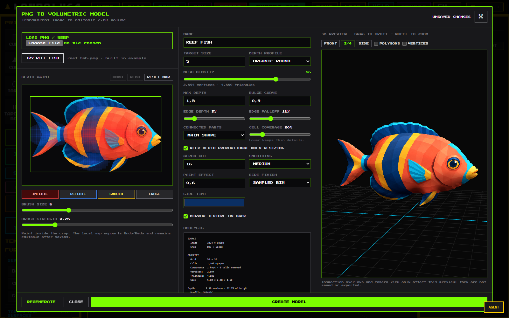

# PNG to Flat Model

`PNG TO FLAT MODEL` converts a transparent PNG or WebP into a textured 2.5D
shell entirely in the browser. It is useful for side-view fish, leaves, badges,
weapons, sprites, signs, wings, and other objects whose silhouette carries most
of their shape.

The tool does not call an AI provider or consume model tokens. V2 measures the
alpha-weighted coverage of each sampled cell, estimates depth from distance to
the silhouette edge, projects boundary vertices within their cells, and lets
you correct the result with a painted depth map. The shell has textured
front/back surfaces and generated side walls; it is not a reconstruction of
hidden anatomy.

For a useful starting point, click **TRY REEF FISH**. The built-in transparent
fish loads with an Organic profile and a painted map that gives the torso and
head more volume while keeping the tail and fins comparatively thin.

## Quick workflow

1. Prepare a PNG or WebP with real transparency. Remove white or checkerboard
   backgrounds in an image editor first.
2. Open Retrovisor and click **PNG TO FLAT MODEL** in the left panel.
3. Click **LOAD PNG / WEBP**, or click **TRY REEF FISH** to inspect and modify
   the included example.
4. Tune the shape and rim. Generation stays in the workbench until you confirm.
5. Paint local depth corrections and use the workbench's **Undo**/**Redo** for
   individual depth-map states.
6. Inspect **Front**, **3/4**, and **Side** views. You can still orbit and zoom,
   and can overlay **Polygons** or **Vertices** for inspection.
7. Click **CREATE MODEL**. Retrovisor waits for the latest valid revision, then
   adds one selected derived group with surface and side meshes.
8. Ctrl+Z/Ctrl+Shift+Z undoes or redoes the complete scene creation as one
   action. This is separate from depth-map Undo/Redo.
9. To revise the result, select its root group and click **EDIT PNG MODEL**.
   Updating is one scene-history action and retains the existing root identity,
   transform, animations, and non-editor group metadata.

## Shape controls

- **Target size** controls the longest visible dimension in scene units.
- **Depth profile** chooses the starting cross-section. **Organic round** fills
  out creatures and rounded props, **Balanced** is more neutral, and
  **Shallow relief** suits signs, coins, and badges.
- **Mesh density** sets the longest grid dimension, from 12 to 72 cells. Raising
  it can preserve more outline detail but also raises the polygon count.
- **Max depth** is a strict full front-to-back ceiling for the generated v2
  geometry, including painted corrections and smoothing. The automatic result
  keeps some headroom for Inflate, so the actual maximum reported by
  **Analysis** can be lower than the configured ceiling.
- **Keep depth proportional when resizing** scales Max depth when Target size
  changes, preserving the depth-to-height ratio.
- **Bulge curve** changes how quickly the center becomes thick. Lower values
  broaden the volume; higher values concentrate it nearer the center.
- **Edge depth** sets the boundary thickness as a fraction of Max depth. The
  boundary remains locked to this thin rim during smoothing.
- **Edge falloff** controls how far inward the transition from that rim extends.
  Increase it for a broader, gentler taper; decrease it for a faster rise.
- **Alpha cut** ignores source pixels below the selected alpha value. Raise it
  to remove faint halos; lower it for translucent fins or hair.
- **Cell coverage** is the minimum alpha-weighted coverage a sampled cell needs
  to enter the silhouette. Lower values retain thin details; higher values
  reject more fringe noise.
- **Connected parts: Main shape** keeps the largest connected sampled
  component. **All parts** retains disconnected components that pass the
  bounded component-size cleanup (two cells by default), which is useful for
  detached fins or floating details.
- **Smoothing** softens interior depth changes. It does not move the source crop
  or thicken the locked boundary.
- **Paint effect** scales the contribution of the red/blue manual depth map.
- **Mirror texture on back** mirrors the rear UVs so the back reads naturally
  from the opposite side.
- **Side finish: Sampled rim** samples source color around the boundary;
  **Side tint** multiplies that texture color. **Solid color** uses Side tint
  alone for the wall. Side-wall alpha is deliberately ignored so antialiased
  source edges do not punch holes through the rim.

## Depth painting and workbench state

- **Inflate** paints red and adds local depth.
- **Deflate** paints blue and removes local depth.
- **Smooth** blends nearby painted corrections.
- **Erase** moves the painted correction toward the automatic result.
- **Reset map** removes all manual corrections.
- **Undo** and **Redo** beside Depth Paint navigate up to 40 local map states.
  Ctrl+Z/Ctrl+Shift+Z also operate this local history while the paint canvas has
  focus.

The workbench tracks a revision for every geometry-affecting change. Pending
geometry invalidates the previous payload and disables confirmation; Create or
Update only commits a payload generated from the latest revision. Name, side
finish/tint, and proportional-resize mode are presentation settings and update
without rebuilding topology.

Image loads and mesh generations are tied to the current workbench session.
Late results from an older load, revision, or already closed workbench are
ignored. If a replacement image fails validation or decoding, the previous
valid source, map, and preview remain available. Closing with unsaved changes
asks for confirmation, and closing releases the session's preview and source
data.

## Silhouette sampling

V2 samples fractional alpha coverage over every grid cell instead of treating
the strongest pixel as the whole cell. It then moves boundary vertices by a
bounded fraction of a cell according to local coverage, while keeping the
surface and wall coordinates aligned. This usually makes diagonal and curved
edges less blocky than a cell-aligned contour.

This is a projected regular-grid contour, not Marching Squares. At low density
the outline can still look cellular. The editable model keeps the textured
surface and rim as two aligned meshes; GLB export welds their boundary into one
indexed manifold shell with separate material groups.

## Input advice and real limits

- Use a clean silhouette with transparent padding around it.
- A side or near-orthographic view produces the most predictable result.
- For a fish, keep fins and tail opaque enough to survive both Alpha cut and
  Cell coverage.
- Start creatures with **Organic round**. Use **Balanced** when the center is too
  full, or **Shallow relief** for intentionally flat artwork.
- Start at medium density. Increase it only when the outline visibly needs it;
  density cannot add information absent from the source.
- Paint broad Inflate strokes over the torso, smaller strokes around the head,
  and Deflate strokes near thin fins or the tail base.

Files selected in the workbench are limited to 5 MB. Before browser decoding,
Retrovisor verifies PNG/WebP magic and MIME, rejects a dimension above 8192 px,
and rejects more than 32 Mi pixels (33,554,432 pixels). A valid source is then
re-rasterized locally as PNG with its longest side limited to 1024 px; the
normalized embedded source must also fit the 5 MB bound. Imported recipes go
through the same embedded-source validation and normalization.

The original external file path is never stored or requested. Mesh density is
bounded to 72, the editor paint map is 64×64, and imported paint maps are
bounded to 96×96.

## Persistence, JSON, and migration

Scene format v2 stores each PNG-derived group as a compact recipe:

- one normalized embedded source image;
- normalized v2 settings and the painted depth map;
- group name and transform;
- an `agentId` when present;
- group animations when present; and
- non-generated child objects attached to the PNG group.

The generated surface, side geometry, analysis cache, and duplicate texture
payloads are deliberately not written to the scene. On load, Retrovisor
regenerates the surface, wall, analysis, materials, and texture from the recipe
before completing scene restoration, then restores saved animations and
non-generated children.

**Copy/Download object JSON** uses the `retrovisor-png-model` v2 format. It
contains the editable recipe, transform, animations, and non-generated child
objects, and regenerates the model on import. Generated-child identifiers and
safe metadata are stored separately from geometry so integrations keep stable
references without duplicating the mesh.

Recipes declare both format version 2 and algorithm version 2. A v1/algorithm-1
recipe is migrated explicitly to the v2 generator with the **Balanced** profile
and a `legacy-balanced-v2` migration marker; its source and paint map remain the
inputs to regenerated geometry. Imports reject versions newer than the current
format or algorithm instead of guessing.

## GLB export

Standard GLB export includes the generated front/back surface, boundary walls,
texture, and compiled animations. The cutout surface retains its alpha-test
threshold and is written with glTF alpha mode `MASK`; side walls remain opaque.
For delivery, the aligned editor meshes are welded into one indexed manifold
shell with surface/rim material groups; the editable scene remains split so its
texture and rim controls can still be changed independently.

The GLB is a delivery asset, not an editable PNG-model recipe. Before export,
Retrovisor sanitizes node extras: embedded source data URLs, generation
settings, paint maps, analysis, duplicate custom-geometry arrays, and raw
animation definitions are removed. Safe integration identifiers can remain,
while the actual texture is embedded through the normal GLB image path.

## Current limitations

- A single image cannot reveal the true back, hidden fins, asymmetry, or full
  anatomy. The output is deliberately 2.5D rather than photogrammetry.
- Subcell projection softens the regular-grid contour but does not replace it;
  diagonal edges can remain stepped at low density.
- Holes in the alpha mask are represented by sampled cell boundaries. Tiny
  holes, isolated pixels, or disconnected parts can disappear depending on
  Cell coverage and Connected parts.
- Main shape intentionally discards every disconnected component except the
  largest. Use All parts when detached details are meaningful.
- Depth painting changes thickness, not the outline or texture. Edit the source
  image when the silhouette itself is wrong.
- A front-facing photograph is usually less convincing than a clean side-view
  illustration because the inferred thickness has less useful shape evidence.

## Troubleshooting

**The app says the image is fully transparent**

Lower **Alpha cut**, or check that the subject actually has non-zero alpha.

**A white rectangle appears around the subject**

The file has a white background rather than transparency. Remove the background
and export it again as PNG or WebP with alpha.

**Fins or thin details disappear**

Lower **Alpha cut** and **Cell coverage**, choose **All parts** if the detail is
detached, increase **Mesh density**, and ensure those pixels are not almost
transparent.

**There are unwanted specks or floating islands**

Raise **Cell coverage** or choose **Main shape**. All parts intentionally keeps
disconnected components that survive cleanup.

**The rim is too thick**

Lower **Edge depth**. If too much of the body stays thin, also reduce
**Edge falloff** so the profile rises sooner.

**The body is too balloon-like**

Switch to **Balanced**, increase **Bulge curve**, lower **Max depth**, then paint
**Deflate** over the problem region.

**The center is too flat**

Switch to **Organic round**, lower **Bulge curve**, or paint **Inflate** with a
broad, soft stroke. The depth percentage in Analysis helps compare results
without relying only on the current preview angle.

**The saved object cannot be edited**

Select the root derived group, not its surface or side child. Clicking either
generated child in the viewport normally promotes selection to that root group;
the properties panel then shows **EDIT PNG MODEL**.
